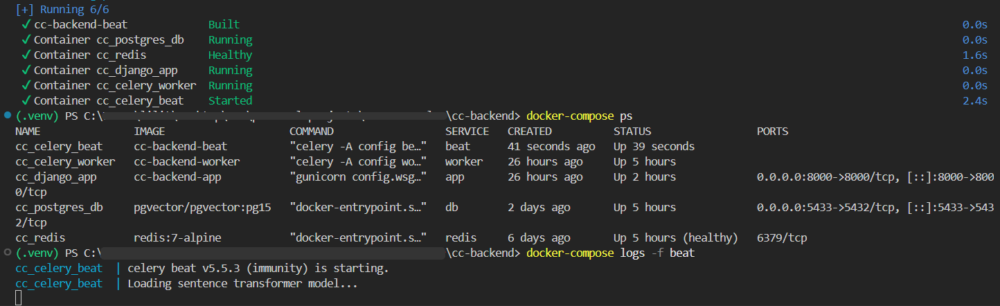
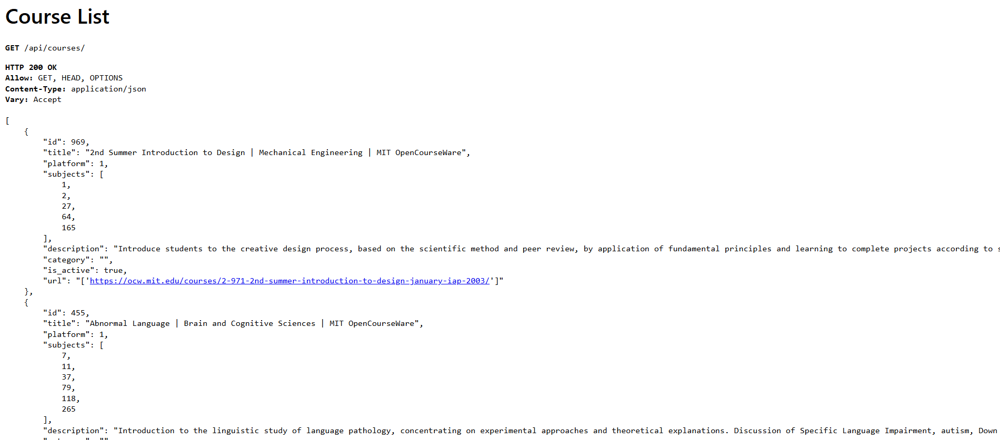
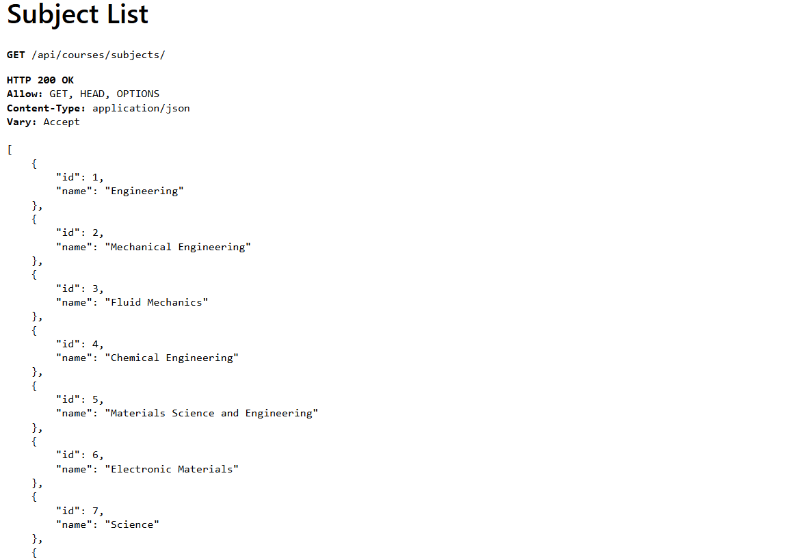
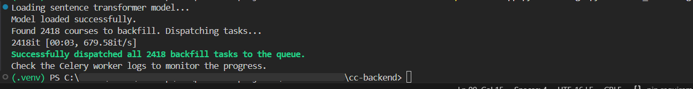
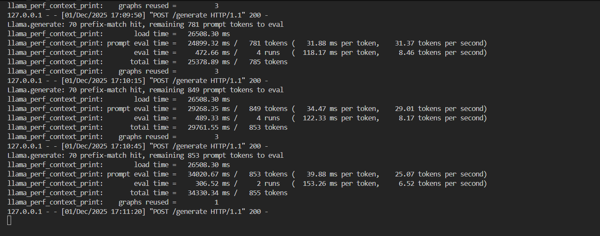

# AI-Powered Curriculum Generator
A web application that programmatically generates university-level degree roadmaps by matching real-world syllabi against a database of online courses using a Retrieval-Augmented Generation (RAG) pipeline.
### Project Motivation
Structured, sequential, and trusted learning paths are crucial for effective self-education. While resources like MIT OpenCourseWare, edX, and similar open platforms provide high-quality content, learners are often left to build their own curriculums. Manually curated lists like OSSU (Open Source Society University) are excellent but static and labor-intensive to maintain.

This project automates the creation of these roadmaps. By leveraging vector search and a local Large Language Model, the application dynamically generates a complete, semester-by-semester degree plan that mirrors an accredited university program, using a constantly updated catalog of online courses.

## Core Features
- **`Automated Data Ingestion`**: A Scrapy-based web scraper autonomously crawls course catalogs (currently MIT OCW ) to build and maintain a local PostgreSQL database of available online courses.
- **`AI-Powered Curriculum Generation (RAG Pipeline)`**:
- - **`Syllabus Ingestion`**: A real-world university syllabus is entered into the system via the Django Admin, defining the required courses for and structure for a degree.
- - **`Vector Search (Retrieval)`**: For each syllabus requirement, the system generates a vector embedding and uses pgvector to perform a semantic search, retrieving the most similar online courses from the database.
- - **`LLM Reasoning (Generation)`**: The top candidate courses are passed to a locally-run LLM (Phi-3-mini), which acts as an expert academic advisor to analyze the candidates and select the single best fit.
- **`Asynchronous & Scalable Architecture`**: The system is built on a asynchronous foundation using Celery and Redis. This allows for long-running tasks like scraping thousands of pages or backfilling embeddings for the entire database to occur in the background without blocking the application.

### Architecture & Tech Stack
This project is containerized with Docker to ensure a consistent and reproducible environment.
- **`Backend`**: Django, Django REST Framework (DRF)
- **`Database`**: PostgreSQL with the pgvector extension for vector similarity search.
- **`AI and Machine Learning`**:
- -  **Embeddings**: sentence-transformers (all-MiniLM-L6-v2) for generating vector representations of course content.
- -  **LLM Engine**: A local instance of Phi-3-mini-4k-instruct (GGUF) served via a minimal Flask API.
- -  **LLM Runtime**: llama-cpp-python for efficient CPU-based inference.
- **`Asynchronous Processing`**: Celery , Redis
- **`Containerization`**: Docker, Docker Compose

## Project status
This repository contains a functional local development environment for the backend services. The core AI pipeline is complete and operational. Next steps include frontend development and cloud deployment.

## Local Development Setup
**Prerequisites**
- Git
- Docker & Docker Compose
### 1. Clone and Configure
Clone the repository:
```Bash
git clone https://github.com/V-enis/CourseCrawler.git
cd cc-backend
```
Create an .env file in the project root. Use the following template, filling in your own secret key and password.
```
SECRET_KEY=your-secret-key
DEBUG=1
ALLOWED_HOSTS=localhost,127.0.0.1

POSTGRES_DB=webdegree (or whatever database name you prefer)
POSTGRES_USER=postgres
POSTGRES_PASSWORD=your-db-password
POSTGRES_HOST=db
POSTGRES_PORT=5432

DATABASE_URL=postgres://${POSTGRES_USER}:${POSTGRES_PASSWORD}@${POSTGRES_HOST}:${POSTGRES_PORT}/${POSTGRES_DB}

HF_INFERENCE_ENDPOINT_URL=http://host.docker.internal:5001/generate
HF_INFERENCE_ENDPOINT_TOKEN=local_token
```
### 2. Download LLM model
The local LLM server requires a model file. Use the huggingface-cli to download the recommended version into a models/ directory.
```bash
# Ensure you have the CLI tool
pip install huggingface-hub

# Download the model file
huggingface-cli download microsoft/Phi-3-mini-4k-instruct-gguf Phi-3-mini-4k-instruct-q4.gguf --local-dir models --local-dir-use-symlinks False
```
### 3. Run the Services
This command will build the Docker images and start all required services (Django, Postgres, Redis, Celery Worker).
```Bash
docker-compose up --build -d
```


In a separate terminal, start the local LLM API server.
```bash
# Activate your local Python virtual environment first
python llm_api.py
```

### 4. Initialize the Database
Apply the database schema and populate it with initial course data.
```Bash
# Run migrations
docker-compose exec app python manage.py migrate

# Run the scraper to populate courses
docker-compose exec app python manage.py run_mit_scraper
```
### 5. Access the Application:
The Django application, including the admin panel, is now available at `http://localhost:8000`.


## Useful Commands
- **Connect to database CLI**:
```bash
docker-compose exec db psql -U postgres -d webdegree
```
- **Backfill Embeddings**:
If courses are missing embeddings, run the following to dispatch generation tasks to the Celery worker.
```bash
docker-compose exec app python manage.py backfill_embeddings
```
- **Generate a Degree**:
After entering a syllabus in the admin, run this command with the syllabus ID to generate the degree roadmap.
```bash
docker-compose exec app python manage.py generate_degree <degree_id>
```

## Previews
**Courses and Subjects**
- API of courses and subjects within the database after scraper(s) have been run
`/api/courses/`

`/api/courses/subjects`


**Backfilling embeddings**
- When for any reason course database has entries with missing embeddings, run `docker compose exec app python manage.py backfill_embeddings` to dispatch tasks (find course without embedding, generate embedding) to celery


**Full Degree Generation**
- A full degree-object generation from a 30+ course syllabus object in the admin. 
- Executed with `docker compose exec app python manage.py generate_degree <degree_id>`
 

**Flask Model API server**
- A preview of the local model (Phi-3-mini-4k-instruct) whilst a degree generation is occuring
- This is accessed at `http://host.docker.internal:5001/generate`, which points to the host machine and listens on port 5001
